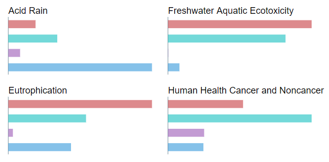
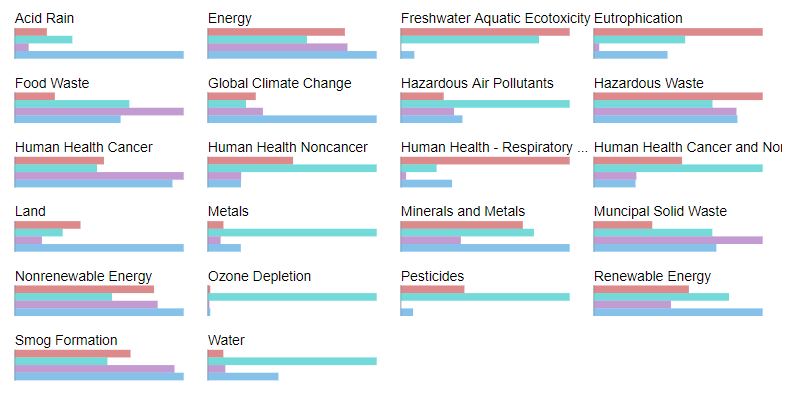

# USEEIO Widgets

## Usage
In order to build and test the widgets you need to have a current version of
[Node.js](https://nodejs.org) installed. Make sure that the `node` and `npm`
commands are available in your systems path (you can test this via `node -v` and
`npm -v` on the command line which should give you the respective version of
these tools). The first step is then to install the build tools and
dependencies:

```bash
cd useeio-widgets
npm install
```

You can build the widget libraries via:

```bash
npm run build
```

This should create a `build` folder which contains in the `lib` sub-folder a
small JavaScript library for each widget. The `build` folder then also contains
some example HTML files that demonstrate the usage of these widgets. To test
these examples, you need some data that you can download from an instance of the
[USEEIO API](https://github.com/USEPA/USEEIO_API) via the following command:

```bash
npm run download -- --endpoint https://path/to/api --apikey an-optional-api-key
```

This will mirror the static data of that API into the `build/api` folder. You
can then start a server that hosts the examples and these data with the
following command:

```
npm run server
```

When you then open `http://localhost:8080` in your browser you should see the
index page with links to the examples.

## Widgets

### Communication between widgets
The communication between the widgets is done via configuration objects and a
set of methods that all widgets implement. There are widgets that display data
based on a configuration (like the `ImpactChart` widget). Calling the `update`
method with a configuration will update the widget:

```js
widget.update(config);
```

Other widgets create new configurations (like the `SectorList` widget). With the
`onChanged` method it is possible to react on these configuration changes:

```js
widget.onChanged((config) => {
  // do something with the updated config
});
```

With these methods the widgets can be linked in the following way:

```js
sectorList.onChanged((config) => {
  impactChart.update(config);
});
```

There can be different widgets that produce and consume configurations on a
page. These widgets can join a transmitter that collects configuration changes
and calls the respective update methods of these widgets:

```js
configTransmitter.join(widget);
```

For example, the `HashConfigTransmitter` uses the anchor part of the URL to
de-/serialize the configuration:

```js
const hashTransmitter = new useeio.HashConfigTransmitter();
hashTransmitter.join(sectorList);
hashTransmitter.join(impactChart);
```

### Impact chart
The impact chart widget shows for a selected set of sectors the LCIA results
of these sectors in comparison to each other where a bar chart is generated
for each LCIA category.



It is based on [D3](https://d3js.org/) as its only dependency. Here is
a complete example regarding its usage:

```html
<!DOCTYPE html>
<html lang="en">
<head>
    <meta charset="utf-8">
    <title>Impact chart example</title>
</head>
<body>
    <div id="impact-chart" style="margin: auto; width: 80%">
    </div>
</body>
<script src="lib/d3.min.js"></script>
<script src="ImpactChart.js"></script>
<script>
    var chart = USEEIO.ImpactChart.on({
        selector: '#impact-chart',
        endpoint: 'http://localhost/api',
        model: 'USEEIO',
    });
    chart.update(['1111A0', '111200', '111400', '112120']);
</script>
</html>
```

The function `USEEIO.ImpactChart.on` creates an instance of an impact chart
and attaches it to an HTML element. It takes a configuration object with the
following fields:

* `selector: string`: the selector of the HTML element (e.g. the ID of a `div`
  element),
* `webapi: string`: configuration of the web API (see
  [USEEIO API](https://github.com/USEPA/USEEIO_API))
* `width: number` (optional, default `500`): the width of the chart in pixels
* `height: number` (optional, default `500`): the height of the chart in pixels
* `columns: number` (optional, default `2`): the number of columns in which the
  bar charts are organized
* `responsive: boolean` (optional, experimental): creates a responsive chart

On the returned chart object, the `update` method can be called which takes an
array of sector codes and on optional array of indicator codes as input and
renders the respective charts for this selection. It is intended to call the
`update` method on each selection change of sectors or indicators instead of
recreating the chart object. Here is an example that uses more optional features:

```ts
var chart = USEEIO.ImpactChart.on({
    selector: '#impact-chart',
    webapi: {
      endpoint: '/api',
      model: 'USEEIOv1.2',
      asJsonFiles: true,
    },
    width: 800,
    height: 400,
    columns: 4,
    responsive: true,
});
chart.update(
    // sector codes
    ['1111A0', '111200', '111400', '112120'],
    // indicator codes
    ['ACID', 'ENRG', 'ETOX', 'EUTR', 'FOOD', 
     'GCC', 'HAPS', 'HAZW', 'HC', 'HNC', 'HRSP', 
     'HTOX', 'LAND', 'METL', 'MINE', 'MSW', 'NREN',
     'OZON', 'PEST', 'REN', 'SMOG', 'WATR']);
```

